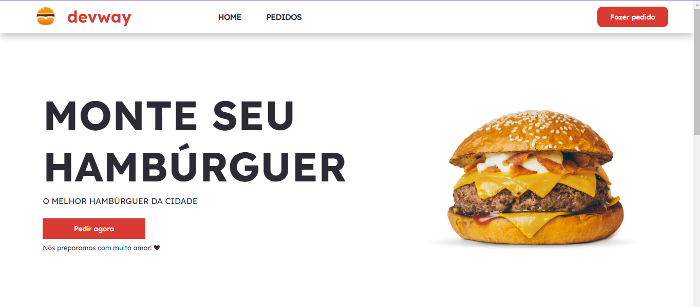
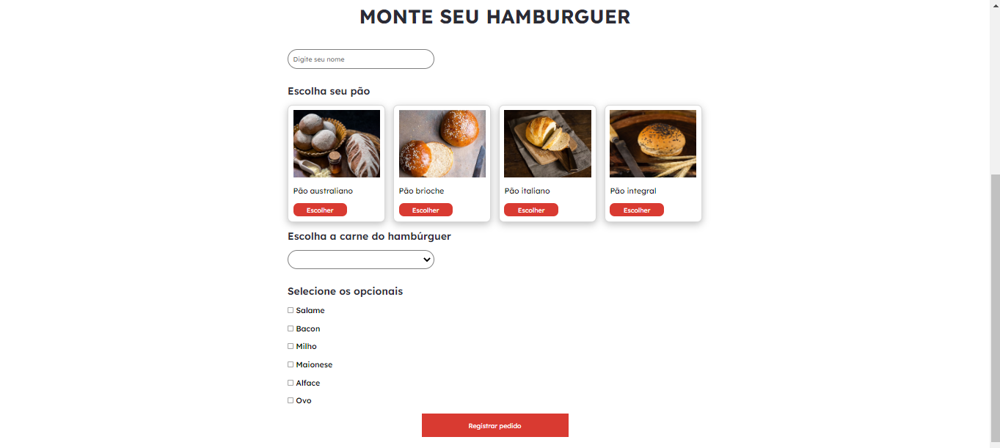
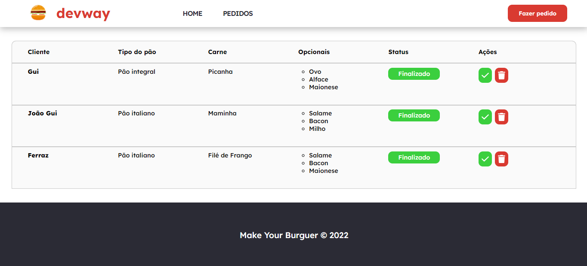

# DEVWAY - Registro de pedidos





>  O projeto chamado DevWay é um sistema de registro de pedidos de Hambúrguer.

Confira a aplicação: https://devway.netlify.app/ <br>

## :page_facing_up: Explicação

O projeto consiste num sistema de registro de pedidos de Hambúrgueres. O usuário preenche um formulário e poderá escolher entre as opções de pães, carnes e opcionais, logo após todas as informações estiverem completas o pedido do usuário é registrado no DB Firestore do Firebase.
Todos os pedidos registrados são listados na rota '/orders', podendo ser acessada pelo Header. Os pedidos são ordenados numa tabela por nível de urgência de 1-4, onde: </br>
1- Solicitado </br>
2- Em preparo </br>
3- Em trânsito </br>
4- Finalizado </br>
O admin pode gerenciar pedidos, mudando seu status e excluindo. 

## 📁 Componentes

**Home:** nesse componente é feita a apresentação do projeto e também está presente o formulário para registrar pedidos. </br>
**Dashboard:** nesse componente estão listados todos os registros de pedidos, ordenados por nível de urgência. </br>
**CardBread:** nesse componente é feito o v-for para a listagem de cards, as informações são recebidas por props do  componente Home. </br>
**Footer:** nesse componente está o rodapé do site. </br>
**Header:** nesse componente está o cabeçalho do site. </br>
 
## 📁 Views

O site tem no total 2 views, sendo elas:

- **Home** 
- **Orders** 
## :dart: Etapas ##

- [x] Configurar Vue Router 
- [x] Criar views 'Home' e 'Orders'
- [x] Componentizar e estilizando página Home
- [x] Criação e validação de Formulário
- [x] Modal para confirmação de geração de pedido com SweetAlert
- [x] Registro de dados do Formulário no Firebase
- [x] Criar e estilizar dashboard na view 'Orders'
- [x] Responsividade da dashboard
- [x] Resgatar dados no Firebase e listá-los na Dashboard
- [x] Ações da dashboard (Finalizar pedido e excluir pedido)
- [x] Seleção do pão vísivel
- [x] Build e Deploy

## :rocket: Tecnologias ##

No projeto foram utilizadas as seguintes tecnologias:

- [VueJs](https://vuejs.org/)
- [Vue Router](https://router.vuejs.org/)
- [SASS](https://sass-lang.com/)
- [Font Awesome](https://fontawesome.com/)
- [Vite](https://vitejs.dev/)
- [Firebase](https://firebase.google.com/docs)

## :closed_book: Requisitos ##

Antes de iniciar :checkered_flag:, você precisa ter [Git](https://git-scm.com) e [Node](https://nodejs.org/en/) instalados.

## :checkered_flag: Começando ##

```bash
# Clone this project
$ git clone https://github.com/jguilhermesl/devway
# Access
$ cd devway
# Install dependencies
$ yarn or npm 
# Run the project
$ yarn start or npm start 
# The server will initialize in the <http://localhost:3000>
```
## 🤝 Colaboradores

Agradecemos às seguintes pessoas que contribuíram para este projeto:

<table>
  <tr>
    <td align="center">
      <a href="#">
        <br>
          <sub>
            <b>João Guilherme</b>
          </sub>
        </a>
      </td>
  </tr>
</table>

<a href="#top">Volte para o topo</a>
